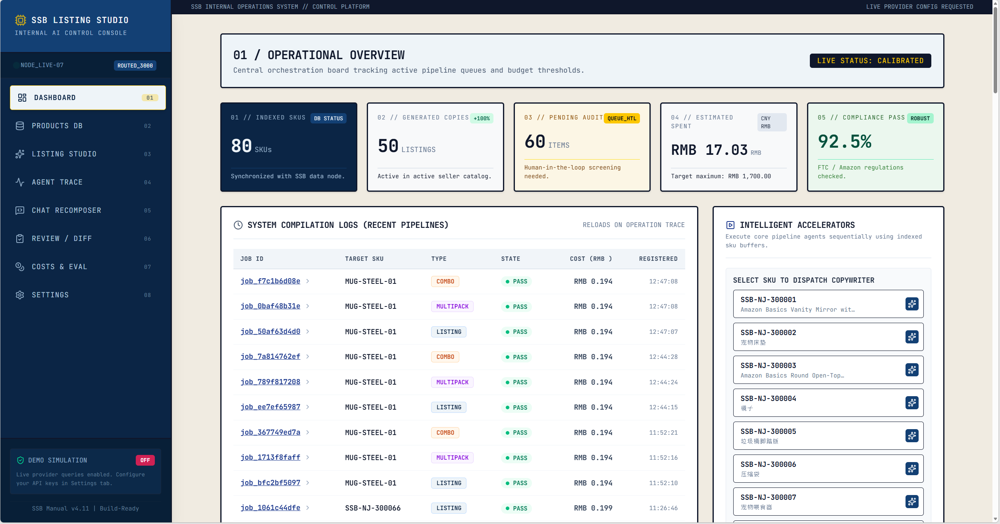
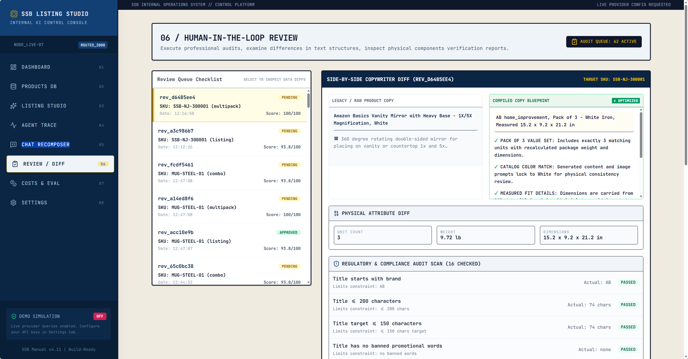
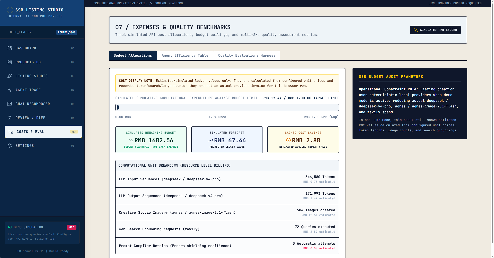
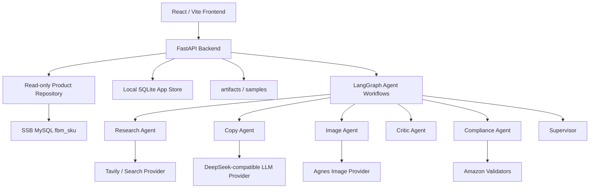

# SSB Listing Studio

> I built an agentic Amazon listing prototype that reads SSB SKU data, performs cited web research, runs a multi-agent workflow, generates copy and images, validates compliance and physical consistency, supports human review, and tracks cost end to end.

This project is not a simple "enter a product name and let the model write a paragraph" demo. I designed it to feel like a real 0-to-1 interview prototype: where the data comes from, what each agent does, whether the output is inspectable, whether the image is close to the original product, where the cost goes, and how failures are surfaced.

## Project Highlights

| Highlight | What I Built | Why It Matters |
| --- | --- | --- |
| Real workflow | FastAPI + React + LangGraph with separate Research, Copy, Image, Critic, and Compliance nodes | Shows that I am not just writing one giant prompt, but an engineered workflow |
| Read-only SSB data | A MySQL `fbm_sku` adapter that only reads data; generated content stays in local SQLite/artifacts/samples | Prevents writes back to the real business database and respects safety boundaries |
| Cited enrichment | Enrichment returns `sourceUrl`, evidence, citations, confidence, and conflict | Makes AI-added facts traceable instead of fabricated |
| Amazon A+ listing output | Title, five bullets, description, A+ modules, images, and backend search terms | Covers the main challenge deliverables |
| Better image consistency | Agnes live mode prefers product reference images for image-to-image generation, and trace records `referenceUsed` | Solves the common problem where pure text-to-image drifts away from the original product |
| Conversational recomposition | Supports prompts like "Make this a 3-pack", Chinese multipack prompts, and combo instructions | Shows the system can handle business intent, not just buttons |
| Inspectable trace | Every job records agent steps, tool calls, tokens, latency, cost, and warnings | Helps explain what happened, why it was slow, and why the result looks the way it does |
| Human review | Review / Diff supports approve, reject, and request revision | Keeps AI output inside a human-in-the-loop workflow |
| Cost awareness | Cost is estimated from tokens, images, search, and cache savings, with a 1500 RMB budget view | Matches the challenge's emphasis on cost discipline |
| Demo + live modes | Works without keys in deterministic demo mode, or with real providers in live mode | Makes the repo reviewable even without secrets |

## Interface Walkthrough

I structured the frontend as a set of clear workspaces. A reviewer can follow them in order and understand the full pipeline.

### 1. Dashboard - Overview and Entry Point



The Dashboard is the first screen I want a reviewer to see. It is not just a data dump. It tells the story of the system state:

- How many SKUs are loaded.
- How many listings have been generated.
- How many items are waiting for human review.
- What the current estimated spend is.
- What the compliance rate looks like.
- Which recent pipeline jobs can be traced further.
- Which SKU can be launched into generation, chat recomposition, or evaluation.

I also fixed a real UX issue here: at first, the page loaded empty and then jumped suddenly when the data arrived. I added loading skeletons, sync hints, animated counters, and a gentle reveal so it feels more like a real SaaS product instead of a flash of content.

### 2. Products DB - SKU Reading and Normalization


The Products DB page shows the product data layer. I wanted reviewers to see that the frontend is not hardcoding product facts. Instead, it exposes the raw source, normalized data, missing fields, and downstream suggestions.

This page does a few things:

- Reads SSB SKU data or demo SKU data when the database is not available.
- Shows a normalized product model for stable downstream agent usage.
- Preserves raw fields so the reviewer can see the original shape of the data.
- Marks missing fields so the model does not pretend to know unsupported facts.
- Displays variation and pricing suggestions as a future extension surface.
- Provides Enrich and Generate Listing actions so the product can flow into the next stage.

The challenge README mentions PostgreSQL, but the provided credential document uses MySQL on port 3306 with a core table named `fbm_sku`. I implemented the system against the actual provided MySQL source and documented the mismatch in [REPORT.md](./REPORT.md).

### 3. Listing Studio - Multi-Agent Listing Generation


Listing Studio is the core page of the project. Clicking `EXECUTE MULTI-AGENT PIPELINE` starts a real backend flow instead of a fake frontend animation.

I added several UX and engineering protections here:

- Each stage is shown explicitly: Fetch, Enrich, Research, Copy, Image, Critic, Compliance.
- The button enters a running state so the user knows the click was received.
- Live provider execution can take 1-3 minutes, so the page shows a clear running message.
- Generated output includes Amazon title, five bullets, description, and backend search terms.
- Backend search terms are guarded by a 250-byte limit indicator.
- The image area shows main, lifestyle, infographic, and A+ hero assets.
- The generated result can be saved as a draft or sent to Review / Diff.

One real issue I found was that pure text-to-image generation could drift far away from the original product. In the current design, the Agnes live image step prefers the product's reference image as input, and the trace records whether the step actually used `image_to_image_reference`, `text_to_image`, or a fallback. That way, a reviewer does not have to guess whether the original image was really used.

### 4. Agent Trace - Every Step Is Inspectable


Agent Trace is one of the most important parts of the project because it proves the system is not a black box.

From the trace, a reviewer can inspect:

- Whether the Supervisor started and finalized the job.
- What SKU the Product Loader read.
- Which sources the Research Agent used.
- What structured copy the Copy Agent produced.
- Whether the Image Agent used a reference image.
- What physical consistency risks the Critic found.
- Whether Compliance flagged title, bullet, search term, or image issues.
- The latency, token usage, estimated cost, and warnings for each step.

If a button does not appear to do anything immediately, this is the page I use to explain what is actually running, where it may be waiting, and whether it failed.

### 5. Chat Recomposer - Multipack and Combo in Natural Language


Chat Recomposer exists to cover the multipack and combo part of the challenge.

It supports prompts like:

```text
Make this a 3-pack
Turn this SKU into a 3-pack
Combine this with SKU STAND-ALUM-09
Bundle the current product with another SKU
```

I did not hardcode this with only a button or a regular expression. I built an LLM-first intent extraction flow with a deterministic fallback parser. In practice, that means:

- When the LLM is available, it is used first to understand the user's intent.
- When the model output is unstable, a deterministic parser can still keep the flow working.
- The trace records where the intent came from, such as `llm_json`, `regex_fallback`, or `clarification`.

Multipack recomposition recalculates:

- unit count
- package weight
- package dimensions
- Pack of N in the title
- bullets and image prompts
- physical attribute diffs

Combo recomposition merges the base facts of two SKUs, reorganizes the title, value story, and image prompt, and recalculates the final listing shape. In the current version, combo image generation mainly uses the primary SKU reference image and describes the second SKU in the prompt. That is a working implementation, but the stronger next step is to pass both SKU images into Agnes as a multi-image reference array.

### 6. Review / Diff - Human Review and Risk Checks



I did not want to frame this project as "AI directly publishes products". In a real e-commerce workflow, listings should go through human review, so I built a Review / Diff page.

This page shows:

- Listings waiting for review.
- Approve / reject / request revision actions.
- Copy diff.
- Physical attribute diff, such as whether weight, dimensions, or unit count changed after multipack/combo recomposition.
- Compliance report.
- Physical consistency report.

This makes the system feel like a real operator tool: AI does the generation and first-pass review, and humans make the final call.

### 7. Costs & Eval - Cost and Quality Monitoring



The challenge and project discussion both emphasized cost awareness, so I built a dedicated Costs & Eval workspace.

This page shows:

- The 1500 RMB target budget.
- A looser 1700 RMB planning ceiling.
- Estimated LLM token cost.
- Image generation count and cost estimate.
- Web search cost estimate.
- Cache savings.
- Per-agent cost ledger.
- Eval harness scores.

My view is that an AI application should not only say "it can generate output". It should also be able to explain how much a run costs, where caching helps, and where retries should be limited.

### 8. Settings - Live / Demo Status

I did not include a screenshot for Settings in the README, but it is still one of the most important pages. It shows whether DB, LLM, Image, and Search are live, demo, or missing, without exposing secrets.

I designed it that way because:

- A reviewer without keys can still walk through the full demo mode.
- I can switch to live mode with `DEMO_MODE=false` when I configure real providers.
- The frontend sees provider state, not secrets.
- `.env` is never committed to GitHub.

## Architecture



The backend is built around a simple rule: the SSB database is read-only, and all generated content is stored locally.

```text
SSB MySQL fbm_sku
  -> ProductRepository read-only
  -> Product normalization
  -> Enrichment with citations
  -> LangGraph multi-agent workflow
  -> Listing / Images / Compliance / Trace
  -> Local SQLite + artifacts + samples
```

That gives me two important properties:

1. I do not write AI-generated content back to the real SSB database.
2. Reviewers can inspect local artifacts, samples, and traces for every generated result.

## Agent Workflows

Listing generation uses an explicit LangGraph flow:

```text
Supervisor Start
-> Product Loader
-> Research
-> Copy
-> Image
-> Critic
-> Compliance
-> Supervisor Finalize
```

Chat recomposition uses a separate graph:

```text
Recomposition Agent
-> Product Resolver
-> Physical Recalculator
-> Copy / Image / Critic / Compliance
-> Finalize
```

The responsibilities are intentionally separated:

| Agent | Responsibility |
| --- | --- |
| Supervisor | Creates the job, drives the workflow, and collects final artifacts |
| Product Loader | Reads SKU data and records normalized data and missing fields |
| Research | Performs web research and preserves citations, evidence, and conflicts |
| Copy | Produces Amazon listing copy and A+ modules |
| Image | Produces main, lifestyle, infographic, and A+ images while recording reference usage |
| Critic | Checks whether the copy or image description drifts away from physical SKU facts |
| Compliance | Checks titles, bullets, banned claims, search term bytes, and image rules |
| Recomposition | Detects multipack/combo intent and recomputes physical attributes |

I chose to split the agents instead of writing everything in one prompt because it is much easier to debug, explain, evaluate, and extend.

## Live Mode and Demo Mode

The project supports two execution modes.

| Mode | Use case | Behavior |
| --- | --- | --- |
| Demo mode | A reviewer has no database access or keys and just wants to inspect the full flow | Uses deterministic local providers so the workflow remains reproducible |
| Live mode | I have real DB, LLM, image, and search credentials configured | Reads SSB MySQL and calls the real providers |

Demo mode is not meant to pretend that a live provider call succeeded. It exists so the repo can still be fully reviewed in a GitHub environment where secrets are unavailable. Provider status, trace warnings, and image generation reports clearly mark the mode being used.

## Quick Start

```bash
docker compose up --build
```

Open:

- Frontend: http://localhost:3000
- API health: http://localhost:8000/api/health

If you only want to work on the frontend locally:

```bash
cd ssb-listing-studio
npm install
npm run dev
```

If you only want to run backend tests:

```bash
python -m pytest api
```

## Live Configuration

Copy `.env.example` to `.env`, fill in the real credentials, and set:

```env
DEMO_MODE=false
```

Example fields:

```env
SSB_DB_HOST=
SSB_DB_PORT=3306
SSB_DB_USER=
SSB_DB_PASSWORD=
SSB_DB_NAME=

LLM_PROVIDER=
LLM_BASE_URL=
LLM_API_KEY=
LLM_MODEL=

IMAGE_PROVIDER=agnes
IMAGE_BASE_URL=https://apihub.agnes-ai.com
IMAGE_API_KEY=
IMAGE_MODEL=agnes-image-2.1-flash

SEARCH_PROVIDER=tavily
SEARCH_BASE_URL=https://api.tavily.com
SEARCH_API_KEY=

BUDGET_TARGET_RMB=
IMAGE_GENERATION_USD=
SEARCH_REQUEST_USD=
```

Security notes:

- Do not commit `.env`.
- Do not commit API keys.
- Do not commit database passwords.
- Do not commit private credential documents.
- The frontend does not display secrets.
- Generated listings, traces, reviews, cost records, and images stay local and are never written back to the SSB database.

## Challenge Coverage

| Challenge requirement | My implementation |
| --- | --- |
| Read SKU data from SSB | `ProductRepository` reads MySQL `fbm_sku` in read-only mode |
| Schema / normalization | `/api/schema`, `/api/products`, and `/api/products/{sku}` preserve raw fields and missing fields |
| Web research with citations | Tavily/search adapter + LLM summary + field-level citations |
| Multi-agent orchestration | Listing generation uses LangGraph with Supervisor, Research, Copy, Image, Critic, and Compliance |
| Amazon A+ listing | Title, five bullets, description, A+ modules, images, and backend search terms |
| Image generation | Agnes Image 2.1 Flash live adapter with reference image support; fallback on failure |
| Multipack / combo | `/api/chat` supports natural-language instructions in English and Chinese, with physical recomputation |
| Agent trace | `/api/traces/{job_id}` and `/api/listings/{job_id}/events` expose execution traces |
| Compliance validation | Titles, bullets, banned claims, search term bytes, A+ alt text, and basic main-image rules |
| Cost tracking | Token, image, search, cache savings, per-agent cost, and budget dashboard |
| Human review | Review / Diff supports approve, reject, and request revision |
| Eval harness | `/api/evals/run` writes `samples/eval_report.json` and `samples/eval_report.md` |

## API Overview

```http
GET  /api/health
GET  /api/settings/status
GET  /api/providers/status
POST /api/providers/self-test
GET  /api/schema
GET  /api/jobs
GET  /api/products
GET  /api/products/{sku}
POST /api/enrich/{sku}
POST /api/listings/{sku}
GET  /api/listings/{job_id}
GET  /api/listings/{job_id}/events
GET  /api/traces/{job_id}
GET  /api/artifacts/{job_id}
POST /api/chat
GET  /api/chat/{session_id}
GET  /api/reviews
POST /api/reviews/{review_id}/approve
POST /api/reviews/{review_id}/reject
POST /api/reviews/{review_id}/request-revision
GET  /api/costs/summary
GET  /api/costs/jobs/{job_id}
POST /api/evals/run
GET  /api/evals/{eval_id}
GET  /api/variations
GET  /api/variations/{sku}
```

## Sample Outputs

I keep reviewable samples under `samples/` so the project can still be understood without live keys.

Typical contents include:

- Standard SKU listing examples
- One multipack example
- One combo example
- `listing.json`
- `trace.json`
- `enrichment.json`
- `compliance_report.json`
- `physical_consistency_report.json`
- `cost_summary.json`
- `diff.json`
- generated image assets
- `samples/eval_report.json`
- `samples/eval_report.md`

## Cost Budget Design

I designed the cost panel around a 1500 RMB target budget, but this part needs an important clarification: the current cost tracking is a simulation and estimate. It is not a real-time provider invoice, and it is not a final billing record generated strictly from every live API response.

What the project has today is a cost-awareness ledger. The system estimates approximate pipeline spend from locally recorded tokens, image generation counts, search request counts, cache savings, and configurable unit prices. This lets a reviewer see that I understand how AI costs should be split, recorded, and surfaced in the product, but it is not yet production-grade billing reconciliation.

| Cost item | Budget idea |
| --- | ---: |
| LLM multi-agent generation | 600 RMB |
| Image generation | 550 RMB |
| Web search / fetch | 150 RMB |
| Vision / Critic / Eval | 200 RMB |
| Retry buffer | 200 RMB |
| Total target | 1500 RMB |

So the cost dashboard in the README and UI is more accurately a cost simulation / estimated ledger. I am not claiming that I have already connected a real API billing system. I am showing how I think about the cost structure of an AI application: which providers a run went through, how many tokens it theoretically used, how many image and search calls happened, how much cache saved, and where these fields should be wired later if real provider usage or billing APIs are added.

## Key Fixes I Made

During development I ran into some practical issues and fixed them:

| Problem | Fix |
| --- | --- |
| Listing Studio looked like nothing happened after clicking | Added running state, stage progress, disabled buttons, and backend status messages |
| Chat Recomposer did not make it obvious that Create 3-Pack was running | Added submitting state, running hints, error handling, and empty-data protection |
| Dashboard jumped suddenly when data arrived | Added skeletons, loading banners, animated numbers, and reveal transitions |
| Generated images were too far away from the original product | Added reference image input in live image generation and recorded whether it was used |
| Tests could accidentally read live `.env` values | Forced demo env during test startup to avoid real API calls and sample pollution |
| `docker compose config` could print secrets | Recommended `docker compose config --quiet` instead |

To me, these fixes matter because they do more than polish the UI. They make the project feel like a real system.

## Verification

Recommended before submission:

```bash
python -m pytest api
cd ssb-listing-studio
npm run lint
npm run build
cd ..
docker compose config --quiet
```

Latest local checks:

- `python -m pytest api`: 13 passed
- `npm run lint`: passed
- `npm run build`: passed
- `docker compose config --quiet`: compose config parsed successfully

Note: if your local `.env` already contains real keys, do not run plain `docker compose config`, because it may print resolved environment variables. `docker compose config --quiet` is safer.

## Room For Improvement

I think this version covers the core challenge loop, but it is not a production publishing system yet. I intentionally keep these limitations visible:

- Combo image generation should pass both SKU reference images to Agnes instead of mainly using the primary SKU reference plus text description.
- Live mode should add a true multimodal visual critic for stronger image verification.
- Amazon category-specific compliance rules can be made more detailed.
- Pricing suggestions should eventually use stronger marketplace pricing signals.
- Provider retries, queueing, concurrency limits, and budget circuit breakers can still be hardened.
- The system produces reviewable listing artifacts, not a live Seller Central publish workflow.

I do not hide these limits, because I want a reviewer to see that I understand where the prototype ends and where the next production step begins.
