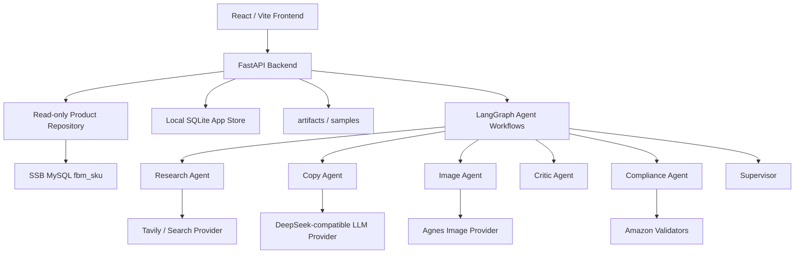

# SSB Listing Studio

> 我做的一个 Agentic Amazon Listing 自动化原型：从 SSB SKU 数据读取商品，通过联网调研、多 Agent 编排、文案生成、图片生成、合规校验、人工审核、成本追踪，最终生成可审查的 Amazon A+ 风格 Listing。

这个项目不是一个简单的“输入商品名，让大模型写几句文案”的 demo。我把它做成了一个尽量接近真实业务流程的 0 到 1 面试原型：数据从哪里来、Agent 每一步做了什么、生成结果能不能审查、图片是否尽量贴近原图、成本花在哪里、失败时有没有提示，这些都被放进了系统里。

## 项目亮点

| 亮点 | 我做了什么 | 为什么重要 |
| --- | --- | --- |
| 真实工作流 | 使用 FastAPI + React + LangGraph，把 Research、Copy、Image、Critic、Compliance 等角色拆成独立节点 | 可以看到我不是只写了一个大 prompt，而是在做工程化编排 |
| SSB 数据只读 | 按提供的 MySQL `fbm_sku` 凭证实现 read-only adapter，生成内容只写本地 SQLite/artifacts/samples | 避免污染真实业务数据库，也符合安全边界 |
| 带来源的联网增强 | Enrichment 返回 `sourceUrl`、evidence、citations、confidence、conflict | 让 AI 补充的信息有依据，弱证据不会变成假参数 |
| Amazon A+ Listing | 输出 title、5 bullets、description、A+ modules、images、backend search terms | 覆盖题目要求的核心交付物 |
| 图片一致性改进 | Agnes Image live 模式下优先使用商品原图做 image-to-image reference，trace 中记录 `referenceUsed` | 解决纯文生图容易和原图完全不像的问题 |
| 对话式重组 | 支持 “Make this a 3-pack”、中文“把这个 SKU 做成 3 件装”、combo 指令 | 展示 Agent 能处理自然语言业务意图，不只是固定按钮 |
| 可审查 Trace | 每个 job 记录 Agent 步骤、工具调用、tokens、latency、cost、warning | 方便定位为什么慢、为什么失败、为什么结果长这样 |
| Human Review | Review / Diff 页面支持 approve、reject、request revision | AI 生成结果进入人工审核，而不是假装全自动发布 |
| 成本预算 | 按 token、图片、search、cache savings 估算成本，围绕 1500 RMB 预算展示 | 回应题目和项目讨论中对成本意识的要求 |
| Demo + Live 双模式 | 没有 key 可以 demo 复跑，有真实配置时走 live provider | 既方便快速看，也能证明真实接口路径存在 |

## 界面演示

我把前端做成几个明确的工作台页面。可以按下面顺序看项目，基本就能理解完整链路。

### 1. Dashboard - 总览和入口


Dashboard 是我设计的项目入口。它不是单纯摆数据，而是让 reviewer 一进来就知道系统当前状态：

- 当前加载到了多少 SKU。
- 已生成多少 listing。
- 有多少内容等待人工审核。
- 当前预计花费多少 RMB。
- 合规通过率大概是多少。
- 最近有哪些 pipeline job，可以点进 Trace 继续追踪。
- 可以直接启动某个 SKU 的 listing 生成，也可以进入 Chat Recomposer 或 Eval。

之前这里有一个体验问题：刚打开时页面是空的，数据加载完成后突然跳变。我已经加了 loading skeleton、同步提示、数字过渡和渐入动画，让它更像真实 SaaS 工具，而不是突然闪一下。

### 2. Products DB - SKU 数据读取和归一化


Products DB 页面展示的是商品数据层。我希望能看到我没有把商品信息写死在前端，而是把“读数据、归一化、缺失字段、原始字段”都展示出来。

这个页面主要做几件事：

- 读取 SSB SKU 数据，或者在无数据库时读取 demo SKU。
- 展示 normalized product model，方便后续 Agent 使用稳定字段。
- 保留 raw fields，让 reviewer 知道原始数据长什么样。
- 标记 missing fields，避免 AI 在缺字段时假装自己知道。
- 展示 variation / pricing suggestion，作为后续商品变体扩展入口。
- 提供 Enrich 和 Generate Listing 操作，让数据进入下一步流程。

题目 README 里提到 PostgreSQL，但提供的凭证文档是 MySQL、端口 3306、核心表 `fbm_sku`。我按实际可运行凭证做了 MySQL read-only adapter，并在 [REPORT.md](./REPORT.md) 里说明了这个冲突。

### 3. Listing Studio - 多 Agent 生成 Listing


Listing Studio 是项目最核心的页面。这里点击 `EXECUTE MULTI-AGENT PIPELINE` 后，后端会启动真实流程，而不是前端假装生成。

我在这里做了几层体验和工程保护：

- 按阶段展示 Fetch、Enrich、Research、Copy、Image、Critic、Compliance。
- 按钮进入运行状态，避免用户以为点击后没反应。
- live provider 运行时间可能需要 1-3 分钟，页面会显示正在运行的提示。
- 生成完成后展示 Amazon title、五点描述、description、backend search terms。
- backend search terms 会按 250 bytes 做限制提醒。
- 图片区展示 main、lifestyle、infographic、A+ hero 四类资产。
- 生成结果可以保存 draft，也可以送到 Review / Diff。

我之前发现一个很现实的问题：如果只用文字 prompt 生图，生成图可能和原始商品完全不像。现在 Image Agent 会在 Agnes live 模式下优先把商品原图作为 reference input，并且在 trace 里记录本次到底是 `image_to_image_reference`、`text_to_image` 还是 fallback。这样 reviewer 不需要猜系统有没有真的用原图。

### 4. Agent Trace - 每一步都能审查


Agent Trace 是我认为这个项目很加分的地方，因为它证明系统不是黑箱。

这里可以按 jobId 查看：

- Supervisor 有没有启动和收尾。
- Product Loader 读到了什么 SKU。
- Research Agent 用了哪些来源。
- Copy Agent 输出了什么结构化文案。
- Image Agent 有没有使用原图 reference。
- Critic 发现了什么物理一致性风险。
- Compliance 有没有拦截标题、bullet、search terms、图片规则等问题。
- 每一步的 latency、tokens、estimated cost 和 warning。

如果某个按钮点了之后没立刻出结果，Trace 页面就是我用来解释“它到底在运行什么、卡在哪里、有没有失败”的页面。

### 5. Chat Recomposer - 用自然语言做 multipack / combo


Chat Recomposer 是为了覆盖题目里的 multipack 和 combo 要求。

它支持这类指令：

```text
Make this a 3-pack
把这个 SKU 做成 3 件装
Combine this with SKU STAND-ALUM-09
把当前商品和另一个 SKU 组合成套装
```

我没有只靠按钮或正则硬写死，而是做了 LLM-first intent extraction，再加 fallback parser。也就是说：

- 有 LLM 时，优先让模型理解用户意图。
- LLM 输出不稳定时，用确定性 parser 兜底。
- trace 会记录 intent 来源，例如 `llm_json`、`regex_fallback`、`clarification`。

multipack 会重新计算：

- unit count
- package weight
- package dimensions
- title 中的 Pack of N
- bullets 和图片 prompt
- physical attributes diff

combo 会合并两个 SKU 的基础信息，重新组织标题、卖点、套装价值和图片提示。当前版本 combo 生图主要使用主 SKU 原图，并把第二 SKU 写入 prompt，这是能运行的实现；后续更好的方式是把两个 SKU 的图片都传入 Agnes 的 image array。

### 6. Review / Diff - 人工审核和风险检查


我不想把这个项目包装成“AI 直接替人发布商品”。真实电商场景里，listing 应该进入人工审核，所以我做了 Review / Diff。

这个页面可以看到：

- 待审核 listing。
- approve / reject / request revision。
- 文案 diff。
- 物理属性 diff，比如重量、尺寸、件数是否因为 multipack/combo 改变。
- compliance report。
- physical consistency report。

这让系统更像一个真实的运营工具：AI 负责生成和初筛，人负责最终判断。

### 7. Costs & Eval - 成本和质量评估


题目和项目讨论里都强调了成本意识，所以我单独做了 Costs & Eval。

这里展示：

- 1500 RMB 目标预算。
- 更宽松的 1700 RMB 规划上限。
- LLM token 成本估算。
- 图片生成次数和成本估算。
- 联网 search 请求成本估算。
- cache savings。
- 每个 Agent 的 cost ledger。
- eval harness 评分。

我的理解是，AI 应用不能只说“能生成”，还要能解释“生成一次大概要花多少钱，哪里可以缓存，哪里应该限制重试”。

### 8. Settings - Live / Demo 配置状态

Settings 页面没有放截图，但它是项目里很重要的安全页。它会显示 DB、LLM、Image、Search 当前是 live、demo 还是 missing，但不会展示任何 secret。

我这样设计是因为：

- 没有 key 时，也可以用 demo mode 完整看流程。
- 我自己配置真实 key 时，可以把 `DEMO_MODE=false` 切到 live mode。
- 前端只看 provider 状态，不接触 API key 或数据库密码。
- `.env` 不会提交到 GitHub。

## 系统架构



后端的原则是：SSB 数据库只读，所有生成内容都保存在本地应用侧。

```text
SSB MySQL fbm_sku
  -> ProductRepository read-only
  -> Product normalization
  -> Enrichment with citations
  -> LangGraph multi-agent workflow
  -> Listing / Images / Compliance / Trace
  -> Local SQLite + artifacts + samples
```

这样做有两个好处：

1. 不会把 AI 生成的内容写回真实 SSB 数据库。
2. reviewer 可以从本地 artifacts、samples、trace 里复查每一次生成。

## Agent 工作流

Listing 生成流程：

```text
Supervisor Start
-> Product Loader
-> Research
-> Copy
-> Image
-> Critic
-> Compliance
-> Supervisor Finalize
```

Chat recomposition 流程：

```text
Recomposition Agent
-> Product Resolver
-> Physical Recalculator
-> Copy / Image / Critic / Compliance
-> Finalize
```

每个 Agent 的职责是分开的：

| Agent | 职责 |
| --- | --- |
| Supervisor | 创建 job、调度流程、收集最终 artifact |
| Product Loader | 读取 SKU、记录 normalized data 和 missing fields |
| Research | 联网调研并保留 citations、evidence、conflict |
| Copy | 生成 Amazon listing 文案和 A+ 模块 |
| Image | 生成主图、场景图、信息图、A+ 图，并记录 reference 使用情况 |
| Critic | 检查文案和图片描述是否偏离 SKU 物理属性 |
| Compliance | 检查标题、bullet、违禁词、搜索词字节数、图片规则 |
| Recomposition | 识别 multipack/combo 意图，并重新计算物理属性 |

我选择拆 Agent，而不是一个 prompt 一次写完，是因为这样更容易 debug、展示、评估和扩展。

## Live 模式和 Demo 模式

项目支持两种运行方式。

| 模式 | 适合场景 | 行为 |
| --- | --- | --- |
| Demo mode | 没有数据库和 API key，只想快速看完整流程 | 使用本地 deterministic provider，流程可复跑 |
| Live mode | 我配置了真实 DB、LLM、Image、Search API | 读取 SSB MySQL，调用真实 provider，生成真实结果 |

Demo mode 不是为了“假装 live 成功”，而是为了让项目在没有 secret 的 GitHub 环境里也能被完整 review。系统会在 provider status、trace warning、image generation report 里标记当前模式。

## 快速启动

```bash
docker compose up --build
```

打开：

- 前端：http://localhost:3000
- 后端健康检查：http://localhost:8000/api/health

如果只想本地开发前端：

```bash
cd ssb-listing-studio
npm install
npm run dev
```

如果只想运行后端测试：

```bash
python -m pytest api
```

## Live 模式配置

复制 `.env.example` 为 `.env`，填入真实配置，然后设置：

```env
DEMO_MODE=false
```

示例字段如下，真实 key 不要提交：

```env
SSB_DB_HOST=
SSB_DB_PORT=3306
SSB_DB_USER=
SSB_DB_PASSWORD=
SSB_DB_NAME=

LLM_PROVIDER=
LLM_BASE_URL=
LLM_API_KEY=
LLM_MODEL=

IMAGE_PROVIDER=agnes
IMAGE_BASE_URL=https://apihub.agnes-ai.com
IMAGE_API_KEY=
IMAGE_MODEL=agnes-image-2.1-flash

SEARCH_PROVIDER=tavily
SEARCH_BASE_URL=https://api.tavily.com
SEARCH_API_KEY=

BUDGET_TARGET_RMB=
IMAGE_GENERATION_USD=
SEARCH_REQUEST_USD=
```

安全注意：

- 不提交 `.env`。
- 不提交 API key。
- 不提交数据库密码。
- 不提交私密凭证文档。
- 前端不显示 secret。
- 生成 listing、trace、review、cost、images 只写本地，不写回 SSB 数据库。

## Challenge 覆盖情况

| Challenge 要求 | 我的实现 |
| --- | --- |
| 从 SSB 数据库读取 SKU | `ProductRepository` 支持 MySQL `fbm_sku`，并保持只读 |
| schema / 数据归一化 | `/api/schema`、`/api/products`、`/api/products/{sku}`，保留 raw fields 和 missing fields |
| 联网调研增强 | Tavily/search adapter + LLM summary + field-level citations |
| 多 Agent 编排 | Listing 使用 LangGraph，拆分 Supervisor、Research、Copy、Image、Critic、Compliance |
| Amazon A+ Listing | title、5 bullets、description、A+ modules、images、backend search terms |
| 图片生成 | Agnes Image 2.1 Flash live adapter，支持原图 reference；失败时 fallback 并写 warning |
| multipack / combo | `/api/chat` 支持中英文自然语言指令，重新计算物理属性 |
| Agent Trace | `/api/traces/{job_id}` 和 `/api/listings/{job_id}/events` 展示执行轨迹 |
| 合规校验 | 标题、bullet、违禁词、search terms bytes、A+ alt、主图基础规则 |
| 物理一致性 | SKU 属性锁定、multipack/combo 重算、Critic report、Review diff |
| 成本统计 | token、图片、search、cache savings、per-agent cost、预算 dashboard |
| Human review | Review / Diff 支持 approve、reject、request revision |
| Eval harness | `/api/evals/run` 输出 `samples/eval_report.json` 和 `samples/eval_report.md` |

## API 列表

```http
GET  /api/health
GET  /api/settings/status
GET  /api/providers/status
POST /api/providers/self-test
GET  /api/schema
GET  /api/jobs
GET  /api/products
GET  /api/products/{sku}
POST /api/enrich/{sku}
POST /api/listings/{sku}
GET  /api/listings/{job_id}
GET  /api/listings/{job_id}/events
GET  /api/traces/{job_id}
GET  /api/artifacts/{job_id}
POST /api/chat
GET  /api/chat/{session_id}
GET  /api/reviews
POST /api/reviews/{review_id}/approve
POST /api/reviews/{review_id}/reject
POST /api/reviews/{review_id}/request-revision
GET  /api/costs/summary
GET  /api/costs/jobs/{job_id}
POST /api/evals/run
GET  /api/evals/{eval_id}
GET  /api/variations
GET  /api/variations/{sku}
```

## 样例输出

我在 `samples/` 里保留了可审查样例，方便不配置 live key 也能看输出结构。

典型内容包括：

- 普通 SKU listing。
- multipack listing。
- combo listing。
- `listing.json`
- `trace.json`
- `enrichment.json`
- `compliance_report.json`
- `physical_consistency_report.json`
- `cost_summary.json`
- `diff.json`
- 生成图片 assets。
- `samples/eval_report.json`
- `samples/eval_report.md`

## 成本预算设计

我按 1500 RMB 目标预算设计成本面板，但这里需要特别说明：当前项目里的成本追踪是模拟和估算，不是实时读取 provider 账单，也不是严格根据每一次真实 API 返回的计费结果生成的最终成本。

它现在做的是一套成本意识展示：系统会按本地记录的 token、图片生成次数、search 请求次数、cache savings 和预设单价，估算一次 pipeline 大概花了多少钱。这样 reviewer 可以看到我知道成本应该怎么被拆、怎么被记录、怎么在产品里展示，但它还不是生产环境里的真实 billing reconciliation。

| 成本项 | 预算思路 |
| --- | ---: |
| LLM multi-agent generation | 600 RMB |
| Image generation | 550 RMB |
| Web search / fetch | 150 RMB |
| Vision / Critic / Eval | 200 RMB |
| Retry buffer | 200 RMB |
| 合计目标 | 1500 RMB |

所以 README 和界面里的 cost dashboard 更准确地说是 cost simulation / estimated ledger。它不是在声称“我已经接好了真实 API 账单系统”，而是在表达我对 AI 应用成本结构的理解：一次生成走了哪些 provider、理论上用了多少 token、图片生成几次、search 几次、缓存省了多少，以及后续如果接入真实 provider usage/billing API，应该把这些字段落到哪里。

## 我做过的关键修复

项目过程中我遇到过几个实际问题，并做了修复：

| 问题 | 修复 |
| --- | --- |
| Listing Studio 点击后像没反应 | 增加运行状态、阶段进度、按钮 disabled、backend status message |
| Chat Recomposer 点击 Create 3-Pack 后用户不知道发生什么 | 增加 submitting 状态、运行提示、错误提示和空数据保护 |
| Dashboard 数据加载完成时突然跳变 | 加 skeleton、loading banner、数字动画和渐入过渡 |
| 生成图片和原图不沾边 | live image provider 增加 reference image input，并在 trace 记录是否使用 |
| 测试可能误读 live `.env` | 测试启动前强制 demo env，避免消耗真实 API 或污染 samples |
| `docker compose config` 可能打印 secret | 文档改为推荐 `docker compose config --quiet` |

这些修复对我来说很重要，因为它们不是只改样式，而是让项目更像一个真实可用的系统。

## 验证方式

提交前建议执行：

```bash
python -m pytest api
cd ssb-listing-studio
npm run lint
npm run build
cd ..
docker compose config --quiet
```

最近一次本机验证结果：

- `python -m pytest api`：13 passed。
- `npm run lint`：通过。
- `npm run build`：通过。
- `docker compose config --quiet`：项目 compose 配置可解析。

说明：如果本地 `.env` 已经填了真实 key，不建议运行普通的 `docker compose config`，因为它可能打印展开后的环境变量。用 `docker compose config --quiet` 更安全。

## 还有提升空间

我认为这个版本已经覆盖面试挑战的主要闭环，但它还不是生产级发布系统。我会诚实保留这些提升空间：

- combo 生图最好同时传入两个 SKU 的原图，而不是主图 reference + 第二 SKU 文本描述。
- live 模式可以接入真正的多模态视觉 critic，对最终图片像素做更严格检查。
- Amazon 不同类目的规则差异很大，后续可以做 category-specific compliance policy。
- pricing suggestion 目前偏保守，后续应该接入更强的 marketplace pricing 数据。
- provider 重试、队列化、并发限制和预算熔断还可以继续增强。
- 当前系统生成的是 reviewable listing artifacts，不包含真实 Seller Central 发布。

我没有把这些不足藏起来，因为我理解更想看的是：我是否知道系统边界在哪里，以及下一步应该怎么把原型推进到生产。

