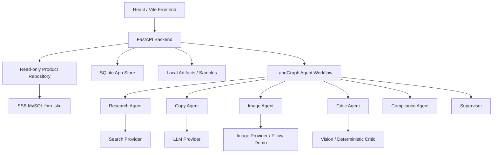

# SSB Listing Studio Report

## 1. Executive Summary

SSB Listing Studio is an agentic Amazon listing generation prototype. It reads SKU data from the provided SSB catalog, enriches product facts with cited research, runs a multi-agent workflow, generates Amazon A+ listing content and images, validates compliance and physical consistency, supports chat-based multipack/combo recomposition, and records trace, cost, review, and evaluation artifacts.

The system is intentionally reproducible without secrets. When live API keys or the SSB database are not configured, deterministic demo providers keep the workflow runnable while clearly marking fallback mode.

## 2. Architecture



## 3. Data Access and MySQL/PostgreSQL Mismatch

The challenge README mentions PostgreSQL, while the provided credential document specifies MySQL on port 3306 and a core table named `fbm_sku`. I implemented the runtime adapter against the provided MySQL source and documented the mismatch instead of asking for clarification.

The SSB database is treated as read-only. Generated listings, traces, cost records, review state, cache, samples, and images are stored locally in SQLite and `artifacts/`, never written back to SSB.

## 4. Agent Design

The listing workflow is implemented as an explicit LangGraph `StateGraph`, not a single mega prompt. The compiled graph passes a typed state through these nodes:

```text
supervisor_start
-> product_loader
-> research
-> copy
-> image
-> critic
-> compliance
-> supervisor_finalize
```

The chat recomposition path also uses a separate graph:

```text
recomposition_agent
-> product_resolver
-> physical_recalculator
-> copy_image_critic_compliance
-> finalize
```

The role split is:

- Supervisor: creates job, coordinates workflow, finalizes artifacts.
- Product Loader: reads normalized product data from the read-only repository.
- Research: produces source-cited enrichment fields and conflict/missing-field notes.
- Copy: calls the LLM provider when configured, validates JSON output, and falls back to deterministic safe copy if the output violates brand-first/title/bullet rules.
- Image: creates image prompts, attempts the image provider in live mode, and falls back to Pillow demo images when no image key is available.
- Critic: checks image/copy vs. physical attributes.
- Compliance: runs Amazon A+ and listing validators.
- Recomposition: parses natural language chat requests into multipack/combo workflows.

Each step records trace entries with tool calls, latency, token estimates, cost estimates, warnings, and intermediate artifacts. Trace inspection is job-based in the frontend, so multiple generations for the same SKU remain separately auditable. The API also exposes `GET /api/listings/{job_id}/events` as a `text/event-stream` replay endpoint for agent-step streaming.

## 4.1 Provider Modes

Providers are isolated behind adapters:

- `LLMProvider`: DeepSeek live mode through OpenAI-compatible `/chat/completions` with `LLM_BASE_URL=https://api.deepseek.com` and `LLM_MODEL=deepseek-v4-flash`; usage is parsed for the cost ledger, with deterministic fallback when not configured.
- `SearchProvider`: Tavily live search through `/search`; enrichment citations are parsed from Tavily `results[].url`, with cited demo fallback when not configured.
- `ImageProvider`: Agnes Image 2.1 Flash live image generation through `https://apihub.agnes-ai.com/v1/images/generations`. The Agnes adapter uses `return_base64=true` for text-to-image output and saves images into local artifacts. Pillow fallback is used when no image key is available.

Demo mode is explicit. Demo citations and demo images are marked as demo/fallback behavior and are not presented as real marketplace research or real commercial photography.

Provider readiness is exposed through `/api/providers/status` and `/api/providers/self-test`. These endpoints report configured/missing/demo status and never return secret values.

## 5. Prompt Iteration

Prompts are stored under `api/app/prompts/` and separated by role. The main design change was moving from one broad generation instruction to narrow role contracts with structured JSON outputs, source requirements, and explicit "do not fabricate physical specs" rules.

Important prompt iterations:

| Iteration | Problem Found | Change Made | Current Evidence |
| --- | --- | --- | --- |
| Broad listing prompt | Early output mixed research, copy, image, and QA responsibilities, making trace review weak. | Split the workflow into Supervisor, Product Loader, Research, Copy, Image, Critic, Compliance, and Recomposition contracts. | `ListingWorkflow` and `RecompositionService` both compile explicit LangGraph state graphs. |
| Research fields only had URLs | A `sourceUrl` alone was not enough to prove what fact came from which source. | Research now performs search -> LLM summary -> field-level `sourceUrl`, `evidence`, `citations`, and `conflict`. | `enrich_3f102c45ba` produced 5 fields with citations/evidence/conflicts in local validation. |
| Chat intent felt like regex only | Multipack/combo parsing needed LLM intent extraction but still needed robust fallback. | Recomposition now tries LLM JSON first, then records `llm_json`, `llm_partial_with_regex_intent`, `regex_fallback`, or `clarification` as the true intent source. | `job_7f7f8769d0` trace step 0 records `source=regex_fallback` for a combo request. |
| Physical facts were easy to overclaim | Copy and image prompts could imply specs not present in SSB data. | Prompts explicitly lock weight, dimensions, unit count, material, and color to the normalized product record or recomputed multipack/combo result. | Listing `physicalAttributes` and review diff record before/after values. |

## 6. Enrichment and Citation Strategy

Enrichment queries four research categories:

- `{title} product specs`
- `{category} amazon listing requirements`
- `{category} common selling points`
- `{material/category} safety certification`

The Research Agent now follows a three-step evidence pipeline:

1. Search provider returns cited results with title, snippet, URL, provider mode, and query.
2. LLM Research Summary receives only the numbered sources and the normalized SSB product.
3. Each enriched field is normalized with `sourceUrl`, `confidence`, `notes`, `evidence`, `citations`, and `conflict`.

The generated fields include category norms, common selling points, compliance keywords, certifications, pricing signals, and risks. The `citations` array points to the exact source objects used, while `evidence` stores short snippets or SSB facts that justify the value. `conflict` is `null` when there is no conflict, or a structured object such as `insufficient_evidence`, `weak_pricing_evidence`, or `missing_required_research_field`.

Database physical fields remain the source of truth. Web research may add context, but conflicting dimensions, weight, material, color, or unit count are retained as conflicts instead of overwriting the SKU record.

## 7. Amazon A+ Compliance Enforcement

The validator checks:

- Brand-first title
- Title length target and hard limit
- Banned promotional / medical language
- Exactly five bullets
- Bullet length
- No contact info
- Backend search terms <= 250 UTF-8 bytes
- A+ alt text and declared image sizes
- Main image size, file size, white background, deterministic product-fill ratio, and text/watermark risk

The compliance report is saved with each listing and displayed in Review / Diff.

## 8. Physical Consistency Strategy

The system does not claim perfect physical consistency. It uses layered safeguards:

- Product DB attributes drive prompts and copy.
- Multipack/combo workflows recalculate unit count, package weight, and dimensions.
- Generated image metadata and deterministic image checks validate unit count, color, material, and white background.
- The Critic step records mismatches instead of hiding them.
- Human review remains the final gate.

## 9. Multipack and Combo Recomposition

The `/api/chat` workflow supports natural language requests for multipack and combo generation. Intent extraction is LLM-first with a deterministic parser fallback. The actual source used is persisted into the job trace as the first `Recomposition` step, so reviewers can see whether a request came from live LLM JSON, partial LLM output plus fallback parsing, pure fallback parsing, or a clarification path.

Multipack recomputes:

- Unit count
- Package weight
- Package dimensions
- Title with `Pack of N`
- Bullets and image prompt

Combo recomputes:

- Combined unit count
- Combined weight
- Combined package dimensions
- Merged title and deduplicated benefits
- Image prompt showing both products

The recomputed weight, dimensions, unit count, source SKUs, and workflow type are written into the generated listing's `physicalAttributes` and sample `diff.json`, so reviewers can inspect the exact before/after physical changes.

## 10. Cost Budget and Actual Spend

Target budget: 1500 RMB.

Planned allocation:

| Area | Budget RMB |
| --- | ---: |
| LLM multi-agent generation | 600 |
| Image generation | 550 |
| Web search / fetch | 150 |
| Vision / Critic / Eval | 200 |
| Retry buffer | 200 |
| Total | 1500 |

Every provider call writes a cost ledger row with input tokens, cached input tokens, output tokens, image count, search count, latency, estimated USD, and estimated RMB. These are estimated/simulated ledger values calculated from configured unit prices and observed counts, not an actual provider invoice for the browser run. Demo providers still record estimated cost so the budget dashboard remains meaningful.

Current default live provider choices, all overridable from `.env` / Docker environment:

| Capability | Provider | Model / Endpoint |
| --- | --- | --- |
| LLM | DeepSeek | `deepseek-v4-flash` at `https://api.deepseek.com` |
| Image generation | Agnes | `agnes-image-2.1-flash` at `https://apihub.agnes-ai.com/v1/images/generations` |
| Search | Tavily | `https://api.tavily.com/search` |
| Product data | SSB MySQL | read-only `fbm_sku` via the provided database access document |

Provider unit prices are configurable through `.env`. The default image generation unit price is `IMAGE_GENERATION_USD=0.003`, matching the Agnes Image 2.1 Flash pricing note supplied for this project.

## 11. Observability and Cache

The app stores jobs, traces, listings, enrichment cache, cost ledger, reviews, chat sessions, and eval runs in SQLite. Enrichment cache defaults to 24 hours and reports cache savings in the Costs & Eval page.

## 12. Evaluation Harness

The eval harness scores selected SKUs on:

- Compliance: 40%
- Physical consistency: 35%
- Listing quality: 25%

It writes `samples/eval_report.json` and `samples/eval_report.md`.

## 13. Human Review Gate

Generated listings automatically enter a pending review queue. Reviewers can approve, reject, or request revision. The UI shows side-by-side copy diffs, compliance reports, physical attributes, and physical consistency reports.

## 14. AI Tool Usage

AI assistance was used for:

- Converting the challenge requirements into an implementation plan and acceptance checklist.
- Drafting role-specific prompts for Research, Copy, Image, Critic, Compliance, and Recomposition.
- Implementing repetitive API, Pydantic, React, and trace/cost plumbing.
- Auditing gaps against the interview prompt, especially citation quality, chat intent provenance, and report completeness.
- Generating deterministic fallback logic so the project remains reviewable without spending provider budget.

Human engineering decisions were still applied to the safety boundaries: SSB DB remains read-only, `.env` is not committed, generated artifacts stay local, and missing/conflicting facts are surfaced instead of silently fabricated.

## 15. Verification Records

Executed verification commands:

```bash
python -m pytest api
cd ssb-listing-studio
npm run lint
npm run build
cd ..
docker compose config
```

Results:

- `python -m pytest api`: 12 passed on 2026-06-23.
- `npm run lint`: TypeScript check passed.
- `npm run build`: Vite production build passed.
- `docker compose config`: project compose parsed successfully.

Concrete local job records generated during validation:

| Flow | Job ID | SKU | Result |
| --- | --- | --- | --- |
| Standard listing | `job_57bd917fda` | `MUG-STEEL-01` | Completed listing workflow with Supervisor -> Product Loader -> Research -> Copy -> Image -> Critic -> Compliance -> Supervisor trace. |
| Multipack chat | `job_ae43a01d1b` | `MUG-STEEL-01` | Completed 3-pack recomposition; listing `physicalAttributes.unitCount` is 3. |
| Combo chat | `job_7f7f8769d0` | `MUG-STEEL-01` | Completed combo recomposition; persisted trace starts with `Recomposition` and records `source=regex_fallback`. |
| Research enrichment | `enrich_3f102c45ba` | `MUG-STEEL-01` | Produced 5 enriched fields with URL citations, evidence snippets, field-level conflicts, and Research LLM Summary cost tracking. |

Provider status observed on 2026-06-23 in the local workstation environment:

- `DEMO_MODE=false`.
- LLM/Image/Search keys were configured in the local `.env`; secret values are not committed and are not exposed through app status endpoints.
- The local Python interpreter used for tests did not have `pymysql` installed, so SSB DB access fell back to the demo catalog. `api/requirements.txt` includes `pymysql==1.1.1`, so Docker or a fresh dependency install has the MySQL driver required for real read-only DB mode.

Note: Docker emitted a local permission warning for `C:\Users\MR\.docker\config.json`. The compose file itself parsed correctly; the warning is a workstation Docker config permission issue.

## 16. Limitations and Future Work

- Live DeepSeek/Agnes/Tavily provider calls are implemented through adapters, but deterministic demo providers are used when keys are missing.
- Physical image consistency is validated through deterministic metadata and image checks in demo mode; live mode should use a true multimodal image critic before claiming production-grade visual verification.
- Pricing suggestions are conservative and should be enriched with marketplace pricing data before business use.
- Real Amazon publishing is out of scope; the system produces reviewable A+ content objects and assets.
- The local validation run proved the API and trace paths, but the SSB database itself was not reachable from this workstation until the environment installs `pymysql` or runs through Docker.
