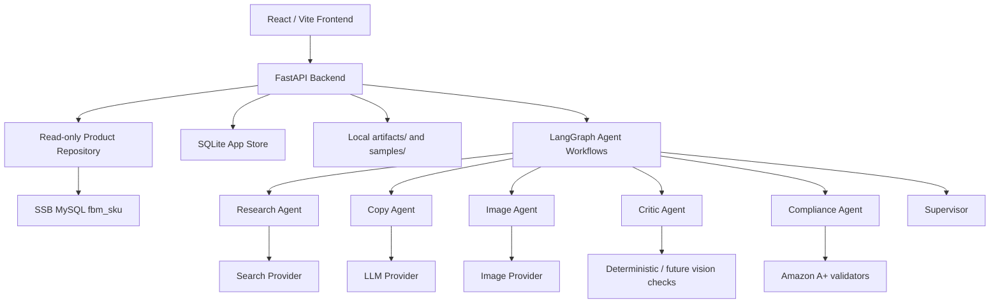

# SSB Listing Studio Report

## 1. Executive Summary

SSB Listing Studio is an agentic Amazon listing generation prototype for the SSB e-commerce catalog workflow. It reads SKU data from the provided SSB source, enriches product facts with cited web research, runs a multi-agent workflow, generates Amazon A+ style listing content and images, validates compliance and physical consistency, supports chat-based multipack/combo recomposition, and records trace, cost, review, and evaluation artifacts.

The implementation is designed to be reviewable in two modes:

- **Live mode**: read-only MySQL catalog access plus configured LLM, image, and search providers.
- **Demo mode**: deterministic local providers when secrets or database access are unavailable, so the complete product flow still runs without pretending to have made live provider calls.

The current version covers the main challenge requirements, including Tier 0-3 and Bonus B1-B5. It is still an interview prototype rather than a production publishing system; the main remaining improvements are stronger live multimodal image verification, combo image generation with two reference images, and deeper category-specific Amazon rules.

## 2. Architecture



The backend intentionally separates business surfaces:

- **Product repository** reads SSB SKU data and normalizes it into a stable `Product` model.
- **Provider adapters** isolate LLM, image, and search APIs behind configurable environment variables.
- **App store** keeps local jobs, traces, listings, cache, cost ledger rows, reviews, chats, and eval runs.
- **Artifacts** store generated images and JSON sample outputs outside the SSB database.
- **Frontend** exposes the workflow as reviewable pages rather than hiding generation behind a single button.

## 3. Data Access and Database Safety

The challenge README says PostgreSQL, but the provided credential document specifies MySQL on port 3306 and a core table named `fbm_sku`. I followed the actually supplied credential document and implemented a MySQL read-only adapter.

Safety decisions:

- SSB database access is read-only by design.
- Generated listings, traces, cost rows, reviews, eval results, cache, and images are stored locally in SQLite, `artifacts/`, and `samples/`.
- The application has no code path that writes generated content back to the SSB catalog.
- `.env`, API keys, database passwords, and private credential files are not part of the committed deliverable.

This mismatch is documented rather than hidden, because in real project work the right response is to preserve evidence and implement against the source that can actually run.

## 4. Requirement Coverage

| Requirement | Evidence in implementation |
| --- | --- |
| Tier 0: Docker, products API, normalized records | `docker-compose.yml`, `/api/products`, `/api/products/{sku}`, `/api/schema` |
| Tier 1: cited enrichment | `EnrichmentService`, Tavily/search adapter, field-level `sourceUrl`, evidence, citations, conflicts |
| Tier 2: multi-agent listing generation | `ListingWorkflow` LangGraph with Supervisor, Product Loader, Research, Copy, Image, Critic, Compliance |
| Tier 2: A+ listing object | title, five bullets, description, A+ modules, backend search terms, images |
| Tier 2: trace | `/api/traces/{job_id}` and SSE replay through `/api/listings/{job_id}/events` |
| Tier 2: physical consistency | SKU attributes drive prompts; Critic reports unit count, color, material, and image/copy consistency |
| Tier 3: multipack/combo chat | `RecompositionService`, `/api/chat`, English and Chinese examples, physical recalculation |
| B1: compliance validator | title/bullet/search-term/A+ alt/main-image checks |
| B2: cost and observability | per-agent trace, token estimates, image/search counts, cache savings, budget dashboard |
| B3: variation management | frontend variation and pricing suggestion surfaces from normalized product data |
| B4: human-in-the-loop | Review / Diff page and approve/reject/request-revision APIs |
| B5: eval harness | `/api/evals/run`, `samples/eval_report.json`, `samples/eval_report.md` |

## 5. Agent Design

The listing workflow is implemented as an explicit LangGraph `StateGraph`, not a single large prompt.

```text
supervisor_start
-> product_loader
-> research
-> copy
-> image
-> critic
-> compliance
-> supervisor_finalize
```

Role responsibilities:

- **Supervisor** creates the job, dispatches the graph, and finalizes artifacts.
- **Product Loader** records the normalized SKU source and missing fields.
- **Research** performs source-cited enrichment and preserves conflicts.
- **Copy** generates structured Amazon listing copy and guards against unsafe LLM output.
- **Image** builds product-faithful image prompts, calls the image provider when configured, writes local image artifacts, and records image source mode.
- **Critic** compares generated image/copy metadata against expected physical attributes.
- **Compliance** runs Amazon listing and A+ validators.

The chat recomposition flow is a separate graph:

```text
recomposition_agent
-> product_resolver
-> physical_recalculator
-> copy_image_critic_compliance
-> finalize
```

This flow uses LLM-first intent extraction with a deterministic fallback parser. The trace records whether intent came from `llm_json`, `llm_partial_with_regex_intent`, `regex_fallback`, or `clarification`, so the system does not hide fallback behavior.

## 6. Provider Modes

Providers are configured through `.env` and exposed safely through Settings and provider status endpoints.

| Capability | Default provider | Notes |
| --- | --- | --- |
| LLM | DeepSeek | OpenAI-compatible `/chat/completions`; model defaults to `deepseek-v4-flash` |
| Image | Agnes Image 2.1 Flash | Live image generation; supports image-to-image reference input when product images exist |
| Search | Tavily | Web research with source URLs used for enrichment citations |
| Product DB | SSB MySQL | Read-only `fbm_sku` adapter |

Provider status endpoints never expose secret values. Missing keys do not crash the app; the workflow uses demo providers and records that mode explicitly.

## 7. Image Generation and Physical Consistency

One important issue discovered during testing was that pure text-to-image generation can create images that do not match the original product. The fix was to use product images as source references whenever available.

Current image strategy:

1. If `Product.image` exists, the backend passes it to Agnes as image-to-image input.
2. Remote image URLs are converted to Data URI Base64 when possible; if conversion fails, the URL is passed directly.
3. Local image paths are converted to Data URI Base64.
4. The prompt tells the image model to preserve product identity, silhouette, shape, visible structure, proportions, color, material, and camera angle.
5. Multipack prompts require exactly N identical copies of the referenced product.
6. The Image trace records `generationMode`, `assetMode`, `referenceUsed`, provider, model, latency, and warnings.
7. If the image API fails or returns no usable image, the system writes deterministic Pillow fallback images and records the fallback instead of silently pretending the live call succeeded.

Physical consistency is handled in layers:

- SKU database fields remain the source of truth for dimensions, weight, color, material, and unit count.
- Web enrichment can add context but cannot silently overwrite physical SKU facts.
- Multipack/combo workflows recompute unit count, package weight, and dimensions.
- Copy and image prompts are constrained to known or recomputed product facts.
- Critic and Compliance reports surface mismatches and warnings for human review.

This is a practical prototype approach. It improves reliability, but it does not claim perfect product-photo fidelity. A production version should add a true multimodal visual critic that inspects the final rendered image pixels against the SKU record.

## 8. Enrichment and Citation Strategy

The Research Agent builds several query categories, such as product specs, Amazon listing requirements, common selling points, and material/category safety considerations. It then normalizes results into structured fields:

- `sourceUrl`: the main cited URL for a field.
- `evidence`: short evidence snippets or source facts.
- `citations`: source objects used by the field.
- `confidence`: confidence score.
- `notes`: explanation or caveat.
- `conflict`: explicit conflict object when data is missing, weak, or inconsistent.

Important rule: enrichment is allowed to add context, but it must not invent dimensions, weight, material, color, or unit count. If evidence is weak, the field carries a conflict marker instead of becoming a fake specification.

## 9. Amazon A+ Compliance Enforcement

The validator checks:

- Brand-first title.
- Title length target and hard limit.
- Banned promotional, medical, and unsupported claim language.
- Exactly five bullets.
- Bullet length.
- No contact information.
- Backend search terms <= 250 UTF-8 bytes.
- A+ alt text and declared image sizes.
- Main image size, file size, white background, deterministic product-fill ratio, and text/watermark risk.

Compliance results are saved with each listing and shown in Review / Diff. The system treats compliance as a gate for review, not as an unchallengeable guarantee.

## 10. Multipack and Combo Recomposition

The `/api/chat` workflow supports natural language recomposition.

Multipack recomputes:

- Unit count.
- Package weight.
- Package dimensions.
- Title with `Pack of N`.
- Bullets and image prompt.
- Physical attributes written into the listing.

Combo recomputes:

- Combined unit count.
- Combined package weight.
- Combined package dimensions.
- Merged title and deduplicated value story.
- Image prompt showing both products.
- `sourceSkus` in the generated listing.

Current limitation: combo image generation uses the first SKU image as the main reference and describes the second SKU in text. This is useful and runnable, but the more robust next step is to pass both product images to Agnes as a multi-image reference array.

## 11. Cost Budget and Observability

The challenge budget target is 1500 RMB. Internally I keep the design conservative enough to stay under the broader 1700 RMB planning ceiling mentioned during project discussion.

Planned allocation:

| Area | Budget RMB |
| --- | ---: |
| LLM multi-agent generation | 600 |
| Image generation | 550 |
| Web search / fetch | 150 |
| Vision / Critic / Eval | 200 |
| Retry buffer | 200 |
| Total | 1500 |

Every provider call records a cost ledger row with:

- input tokens,
- cached input tokens,
- output tokens,
- image generation count,
- search request count,
- latency,
- estimated USD,
- estimated RMB,
- provider and model.

The displayed costs are estimates calculated from configured prices and observed counts. They are not an actual provider invoice for the current browser run. Demo providers still record estimated costs so the budget dashboard remains meaningful and testable without live spending.

## 12. Frontend Product Surfaces

The frontend is built to make the workflow understandable for a reviewer:

- **Dashboard** summarizes jobs, SKU count, pending reviews, budget, and compliance; loading transitions avoid abrupt blank-to-data jumps.
- **Products** exposes normalized records, raw fields, missing fields, variation signals, enrichment, and generation actions.
- **Listing Studio** shows generated copy, A+ modules, backend search terms, and image assets.
- **Agent Trace** shows job-based trace from the backend, including image generation source mode and warnings.
- **Chat Recomposer** supports English and Chinese multipack/combo requests.
- **Review / Diff** shows approval state, copy diff, physical diff, compliance, and consistency report.
- **Costs & Eval** shows budget, per-agent cost, cache savings, and eval harness.
- **Settings** reports provider readiness without exposing secrets.

## 13. Human Review Gate

Generated listings automatically enter a pending review queue when requested. Reviewers can:

- approve,
- reject,
- request revision with notes.

This matters because physical consistency and compliance can be improved by automation, but should not be treated as a fully autonomous publishing decision in an interview prototype.

## 14. Evaluation Harness

The eval harness scores selected SKUs on:

- Compliance: 40%.
- Physical consistency: 35%.
- Listing quality: 25%.

It writes `samples/eval_report.json` and `samples/eval_report.md` for review. The score is useful for regression testing and comparing changes, not for claiming marketplace performance.

## 15. Prompt Iteration

Key prompt and workflow iterations:

| Iteration | Problem Found | Change Made | Evidence |
| --- | --- | --- | --- |
| Single broad prompt | Trace was weak and responsibilities were mixed | Split into role-specific agents and LangGraph nodes | Listing and recomposition workflows have explicit graph steps |
| Simple source URLs | URLs alone did not prove which fact came from where | Added evidence, citations, confidence, and conflict fields | Enrichment API returns field-level provenance |
| Chat looked like regex | Challenge asks for agent-driven recomposition | Added LLM-first intent extraction plus persisted fallback provenance | Recomposition trace records intent source |
| Pure text-to-image | Generated images could drift away from SKU photo | Added Agnes image-to-image reference input when `Product.image` exists | Image Provider test and Image trace `referenceUsed` |
| Overclaiming physical consistency | Prototype checks are not the same as true visual verification | REPORT and UI surface warnings and limitations | Critic/compliance reports plus human review gate |

## 16. AI Tool Usage

AI assistance was used for:

- Translating the challenge into implementation tasks and an acceptance checklist.
- Drafting role contracts and prompts for Research, Copy, Image, Critic, Compliance, and Recomposition.
- Implementing repeated FastAPI, Pydantic, React, trace, cost, and sample-output plumbing.
- Auditing requirement gaps, especially image consistency, citation quality, chat intent provenance, and documentation.
- Improving wording in README/REPORT so the final deliverable is easier to evaluate.

Human engineering judgment was applied to safety and product decisions:

- SSB DB stays read-only.
- `.env` and secret values are not committed.
- Generated artifacts remain local.
- Missing/conflicting facts are surfaced instead of silently fabricated.
- Demo mode is clearly marked rather than presented as live provider output.

## 17. Verification Records

Verification commands:

```bash
python -m pytest api

cd ssb-listing-studio
npm run lint
npm run build
cd ..

docker compose config --quiet
```

Latest local verification on 2026-06-23:

- `python -m pytest api`: 13 tests passed.
- `npm run lint`: TypeScript check passed.
- `npm run build`: Vite production build passed.
- `docker compose config --quiet`: compose configuration parsed successfully.

Additional checks covered by tests:

- Pack count parsing in English and Chinese.
- Product normalization and missing fields.
- Provider defaults for DeepSeek, Agnes, and Tavily.
- Agnes endpoint construction.
- Agnes image-to-image payload includes reference image input.
- Cost estimation uses configured image/search unit prices.
- API health, products, jobs, enrichment, listing trace, reviews, eval, and chat flows.
- Image Agent trace records reference/image-generation mode.
- Provider status does not expose secrets.

Note: If live keys are present in `.env`, use `docker compose config --quiet` instead of plain `docker compose config`, because the plain command can print resolved environment variables. On this workstation Docker may emit a local permission warning for `C:\Users\MR\.docker\config.json`; the project compose file itself parses correctly.

## 18. Sample Outputs

The repository includes sample outputs under `samples/`, including standard SKU listings, a multipack example, a combo example, images, traces, compliance reports, physical consistency reports, diffs, cost summaries, and eval reports.

These samples are useful for review because they show the shape of the final artifacts without requiring a reviewer to spend live provider budget first.

## 19. Limitations and Future Work

I intentionally keep these limitations visible:

- Live provider calls are implemented, but demo providers are still required for reproducible review without secrets.
- Live image consistency is improved with reference-image input, but production-grade verification should use a true multimodal critic.
- Combo images should pass both SKU images to the image model instead of relying mainly on the first SKU reference plus text description.
- Pricing suggestions are conservative and should be connected to stronger marketplace pricing data before business use.
- Amazon rules differ by category; a production system should maintain category-specific compliance policies.
- Real Amazon publishing/upload is out of scope. The system produces reviewable A+ content objects and assets, not a live Seller Central submission.

These are not blockers for the interview challenge; they are the next engineering steps that would move the prototype toward production.
